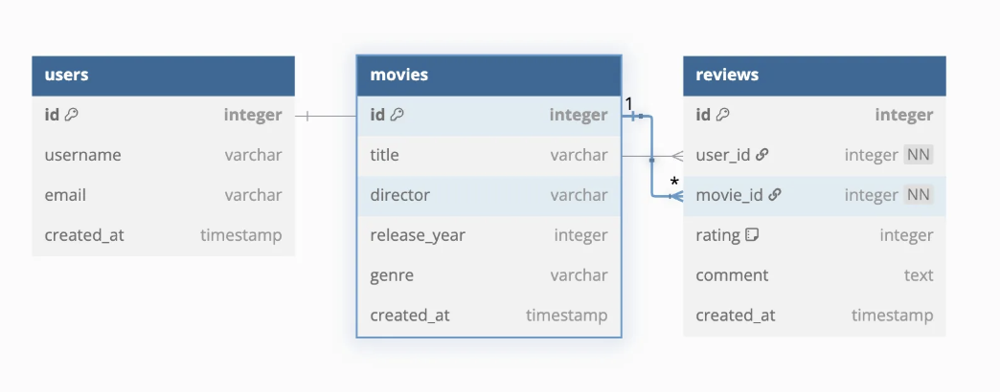

# Movie Review

## ERD
아래는 데이터베이스 ERD 다이어그램입니다.

  <!-- ERD 이미지 경로 -->

---

## API 명세서

### User API

| Method | Endpoint           | 설명       |
|--------|--------------------|------------|
| GET    | /api/users         | 모든 사용자 조회 |
| GET    | /api/users/{id}    | 특정 사용자 조회 |
| POST   | /api/users         | 사용자 생성 |
| PUT    | /api/users/{id}    | 사용자 수정 |
| DELETE | /api/users/{id}    | 사용자 삭제 |

### Movie API

| Method | Endpoint           | 설명       |
|--------|--------------------|------------|
| GET    | /api/movies        | 모든 영화 조회 |
| GET    | /api/movies/{id}   | 특정 영화 조회 |
| POST   | /api/movies        | 영화 생성 |
| DELETE | /api/movies/{id}   | 영화 삭제 |

### Review API

| Method | Endpoint           | 설명       |
|--------|--------------------|------------|
| GET    | /api/reviews       | 모든 리뷰 조회 |
| GET    | /api/reviews/{id}  | 특정 리뷰 조회 |
| POST   | /api/reviews       | 리뷰 생성 |
| DELETE | /api/reviews/{id}  | 리뷰 삭제 |
